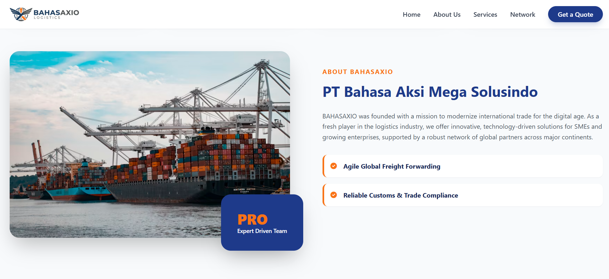

# BAHASAXIO — Corporate Website

> Official landing page for **PT Bahasa Aksi Mega Solusindo** — a modern logistics & supply chain company based in South Jakarta, Indonesia.

🌐 **Live Preview:** [kingirbah.github.io/bahasaxio-web](https://kingirbah.github.io/bahasaxio-web)

> ⚠️ This website is currently **unreleased** and under active development.

---

## Preview

### Home Page


---

## About

BAHASAXIO is a newly established logistics provider dedicated to agility, transparency, and precision in international freight management — serving SMEs and growing enterprises through a global network of partners.

---

## Page Sections

| Section | Description |
|---|---|
| **Hero** | Brand intro with parallax background & CTA |
| **Stats** | Global network, 100% commitment, secure cargo, 24/7 support |
| **About** | Company background & key strengths |
| **Services** | Air Freight, Ocean Freight, Customs Clearance |
| **Contact** | Quote request form & company contact details |
| **Footer** | Quick links & social media |

---

## Tech Stack

- HTML5
- Tailwind CSS (CDN)
- Font Awesome 6
- Vanilla JavaScript

---

## Structure

```
bahasaxio-web/
├── index.html
└── assets/
    ├── style.css        # Global styles & hero background
    ├── script.js        # Navbar scroll & scroll spy
    └── img/
        ├── logo.png
        └── logos.png    # Favicon
```

---

## Status

🚧 **Unreleased** — Work in progress. Not yet officially launched.